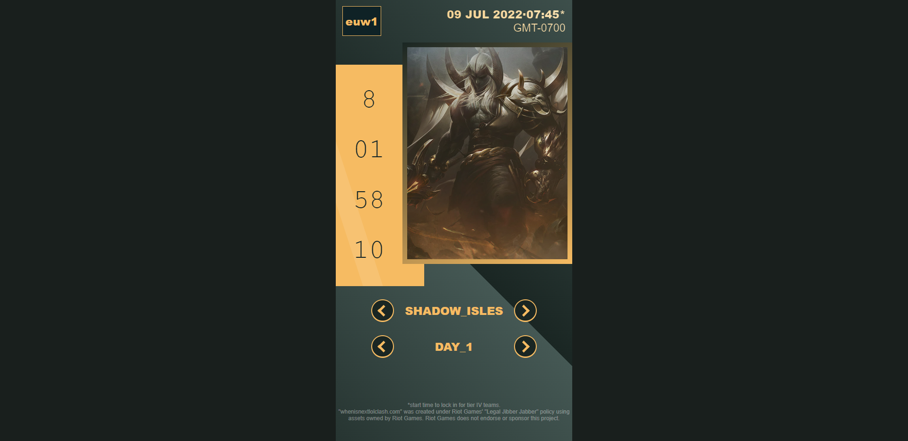

# whenisnextlolclash

## Clash?
Riot Games organizes one-time community tournaments for its game League Of Legends called *clash* tournaments. These tournaments are held no more than once a month, and during these events, a large number of players log in to the game to participate in the tournament. These are important events for some players who need to gather friends to create a team of 5 players. The players have to organize themselves according to the schedule set by Riot Games.

## Objective
**whenisnextlolclash** is there to provide players with an easy way to know *when the next lol clash is*.
Currently, they have to go to news site to find it or the lol launcher to access the clash tab and eventually get that information.

This website is the one-stop solution for players who wants to plan ahead to rock the next clash.

